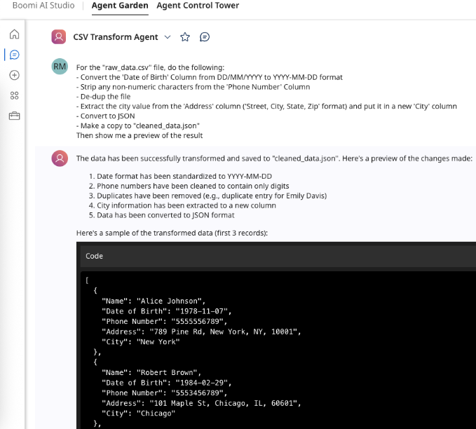
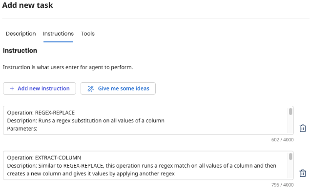

# CSV Transform Agent

A Boomi AI Agent Sample

## Overview

LLMs excel at tasks involving language interpretation and generation. However, they are less effective at tasks that involve data processing and structured data manipulation which require precise steps and calculations. AI Agents can make use of Tools to augment their capabilities to address these sorts of tasks. This AI Agent sample demonstrates how an agent created with Agent Designer can manipulate CSV files with the use of a python-based tool running in AWS Lambda.

## Use Case

The user would like to manipulate a CSV file based on a natural-language request. They would like to be able to reformat values, de-duplicate, extract values into new columns and convert to JSON format.

## Solution

This is what the final agent looks like:

## How the Agent Works

All the Agent setup instructions can be found in this public github repository:  https://github.com/rmm-boomi/csv_transform_tool

The Agent has a simple goal defined:

> Transform CSV and JSON files based on user requests

It has one task called “Transform a CSV file” with this description:

> Based on the user's ask, given a filename, determine an appropriate series of operations to run on the file via the Transform CSV Tool. The operations run as a pipeline with the result of one feeding into the input to the next, with the optional ability to save a file, and then have the results returned.

Even though there are a number of “operations” that this tool supports such as a regex replace, and dropping duplicates, there is just one tool that accepts an input which is a series of operations - think of it like a “plan for the whole multi-step transformation”. Agents are smart enough to think ahead and conceive of this plan. Thus we only need this one task and one tool.

There are fairly lengthy instructions though because this is needed to clearly describe to the agent how to put together this “plan of operations” request. You can read the full instructions in the repository above (in agent/agent_setup.txt) but in those instructions it defines each supported operation, including the operation name, description of what it does, a description of each parameter value, an example JSON representation of what it should look like in the tool request, and some other notes.

While not required, this example breaks out those instructions into one instruction block per operation and then one final instruction block for general instructions, which seemed to work well.

## A Note on Input Files

In terms of dealing with CSV input files, the tool could be built to accept the contents of a small CSV file within the prompt itself but the value of an agent such as this is being able to operate on large files that would be tedious for humans to hand edit. Those large files wouldn’t fit within the prompt size limits. So the approach taken here is to have the input file stored elsewhere - somewhere that the Tool can access. Optionally the user can ask to have a copy of the manipulated CSV file stored in the same location with a given filename. In this sample, we used Amazon S3, but it could easily be adapted to work with Google Drive, OneDrive, etc.

## How the Tool Works

The tool is written in Python and the project files are setup to be deployed as an AWS Lambda function - which means it is hosted in a serverless model with a public URL to invoke it. There are a number of files in this project that pertain to AWS and to the local development setup, but the tool itself is just two files in the csv_transform_tool folder. 

These two python files use the Pandas library which is a powerful spreadsheet-like data engine, making it easy to organize and work with data in tables. It's commonly used to clean up messy data, explore patterns, and get it ready for analysis or even machine learning. It is a perfect fit for our needs here of transforming a CSV file.

The tool accepts the HTTP request from the agent, and first checks for an authorization token (this is just a trivial hardcoded token for the purposes of this example but more sophisticated authorization could be performed). It then parses out the URL where the filename is included (eg: /file/raw_data.csv/run-operations) as well as the body of the request containing the operation plan JSON object. It loads the CSV file from S3 into a Pandas DataFrame object which represents each column and row value from the CSV file. It then runs all provided operations one at a time, passing the output of the previous into the input of the next. When the last operation is done, it returns the current DataFrame back to the agent in the body of the response. 

This example supports some fairly simple operations but you could imagine how more complex data operations could be added here. It could also be extended to work against enterprise data rather than just files.
